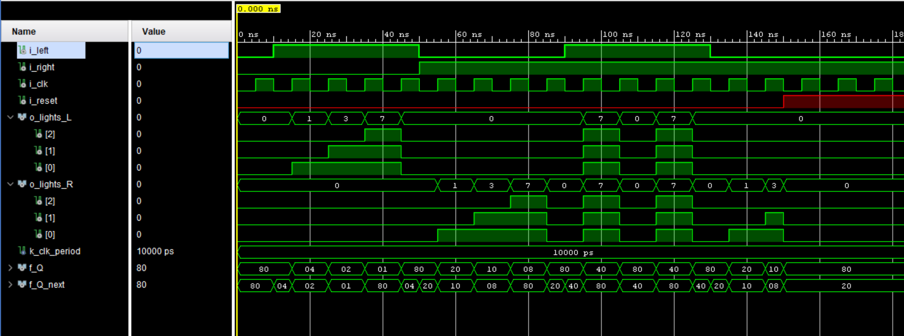
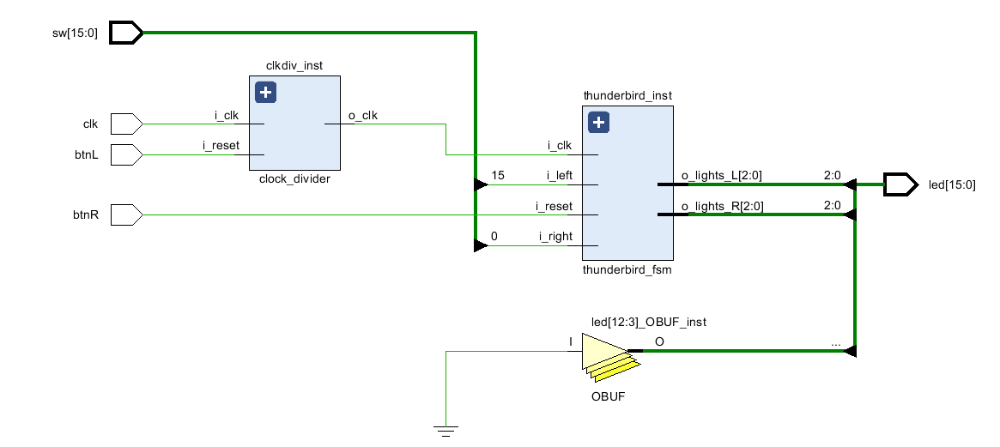

# Lab 3: Thunderbird Turn Signal

VHDL for ECE 281 [Lab 3](https://usafa-ece.github.io/ece281-book/lab/lab3.html)

Targeted toward Digilent Basys3. Make sure to install the [board files](https://github.com/Xilinx/XilinxBoardStore/tree/2018.2/boards/Digilent/basys3).

Tested on Windows 11.

---

## Build the project

You can simply open `thunderbird.xpr` and Vivado will do the rest!

## GitHub Actions Testbench

The workflow uses the [setup-ghdl-ci](https://github.com/ghdl/setup-ghdl-ci) GitHub action
to run a *nightly* build of [GHDL](https://ghdl.github.io/ghdl/).

The workflow uses GHDL to analyze, elaborate, and run the entity specified in the `.github/workflows/testbench.yml`.

```yaml
env:
  TESTBENCH_ENTITY: myfile
```

If successful then GHDL will quietly exit with a `0` code.
If any of the `assert` statements fail **with** `severity error` then GHDL will cease the simulation and exit with non-zero code; this will also cause the workflow to fail.


## Waveform


## Top Basys Diagram
https://excalidraw.com/#json=SrLmqD8iZA2ACI-8lRXtC,4giMDJSZNutJSnBVMwoE9w

## RTL Schematic


## Documentation
My partner on this lab was C3C Sampson McClung. We worked together to check our one-hot encoding tables. I worked with him to change my code from binary encoding to one hot encoding. Otherwise, this work is entirely my own.
